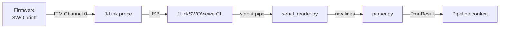

# Data Capture

The capture subsystem collects PMU counter data from the target MCU over
Serial Wire Output (SWO) and optionally power measurements via Joulescope.

## SWO capture pipeline



### JLinkSWOViewerCL

The SEGGER `JLinkSWOViewerCL` tool captures SWO trace output. It's started
as a subprocess and its stdout is piped to the serial reader:

```python
proc = subprocess.Popen(
    ["JLinkSWOViewerCL", "-device", soc, "-if", "SWD", "-speed", "4000"],
    stdout=subprocess.PIPE,
    stderr=subprocess.PIPE,
)
```

The reader collects lines until it sees `HPX_END` or a timeout expires.

### HPX protocol

The firmware prints a structured text protocol over SWO. The protocol is
line-oriented and human-readable for debugging:

```
HPX_START
HPX_META arena_size=131072
HPX_META model_size=45632
HPX_META tensor_count=24
HPX_META layer_count=13
HPX_PRESET cpu
HPX_COUNTERS CPU_CYCLES,INST_RETIRED,LD_RETIRED,ST_RETIRED,BR_RETIRED,BR_MIS_PRED,STALL_FRONTEND,STALL_BACKEND
HPX_ITER 0
0,CONV_2D,1234567,456789,123456,78901,23456,1234,5678,9012
1,DEPTHWISE_CONV_2D,987654,321098,76543,21098,7654,321,987,654
...
HPX_ITER 1
0,CONV_2D,1234568,456790,123457,78902,23457,1235,5679,9013
...
HPX_PRESET_DONE
HPX_PRESET cache
HPX_COUNTERS L1D_CACHE,L1D_CACHE_RD,L1D_CACHE_REFILL,...
HPX_ITER 0
...
HPX_PRESET_DONE
HPX_END
```

### Protocol elements

| Line prefix | Meaning |
|---|---|
| `HPX_START` | Marks beginning of profiling output |
| `HPX_META key=value` | Metadata about the model/runtime |
| `HPX_PRESET <name>` | Start of a counter preset group |
| `HPX_COUNTERS <csv>` | Counter names for this preset |
| `HPX_ITER <n>` | Start of iteration n |
| `<idx>,<op>,<c1>,...` | Layer data row (index, op name, counter values) |
| `HPX_PRESET_DONE` | End of this preset's data |
| `HPX_END` | All profiling complete |

## Parser

**File:** `capture/parser.py`

The parser processes the raw SWO lines into structured data:

```python
def parse_hpx_output(lines: list[str]) -> PmuResult:
    """Parse HPX protocol lines into a PmuResult."""
```

### Parsing steps

1. **Extract metadata** — `HPX_META` lines → `dict[str, str]`
2. **Group by preset** — lines between `HPX_PRESET` and `HPX_PRESET_DONE`
3. **Parse CSV rows** — each data line → layer index, op name, counter values
4. **Average iterations** — for each layer, average counters across iterations
5. **Build PresetResult** — one per counter preset

### Result structure

```python
@dataclass
class PmuResult:
    metadata: dict[str, str]         # HPX_META key-value pairs
    presets: list[PresetResult]      # One per counter pass

@dataclass
class PresetResult:
    name: str                        # Preset name (e.g. "cpu")
    counter_names: list[str]         # Column headers
    layers: list[LayerResult]        # Per-layer averaged data

@dataclass
class LayerResult:
    index: int                       # Layer index (0-based)
    op_name: str                     # TFLite op name
    counters: dict[str, float]       # counter_name → averaged value
```

## Multi-pass merging

When profiling requires more counters than the hardware supports (8 on
Cortex-M55), the pipeline runs multiple passes. After all passes complete,
the report stage merges them:

```python
# Merge presets into unified layer results
for preset in pmu_result.presets:
    for layer in preset.layers:
        merged[layer.index].counters.update(layer.counters)
```

The merge assumes:
- **Layer ordering is stable** — same model produces same layer indices
- **CPU_CYCLES is repeated** in every preset for cross-validation
- **Layer count is identical** across presets

If layer counts don't match (firmware issue), the merge raises a
`CaptureError` with diagnostics.

## Timeouts and error handling

| Scenario | Behavior |
|---|---|
| SWO never starts | Timeout after 30s → `CaptureError("No SWO output")` |
| Partial output | Timeout after last line + 10s → `CaptureError("Incomplete")` |
| Firmware crash | Detects missing `HPX_END` → reports last seen line |
| Invalid CSV | Skips malformed rows, warns, continues |

## Power capture

When `power.enabled` is true, the power stage runs after PMU capture:

1. **Reset target** — power-cycle via Joulescope
2. **Start capture** — begin current/voltage sampling
3. **Wait for duration** — `power.duration_s` seconds
4. **Stop and compute** — average current, peak current, energy

The power result is independent of PMU data — they capture different aspects
of the same inference workload. Correlating them is done at the report level,
not during capture.
