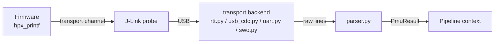

# Data Capture

The capture subsystem collects PMU counter data from the target MCU over the
configured transport — RTT by default, with USB CDC, UART, and SWO as
alternatives (see [Capture Transports](../guide/transports.md)) — and
optionally power measurements via Joulescope.

## Capture pipeline


```mermaid
graph LR
    A[Firmware<br/>hpx_printf] -->|transport channel| B[J-Link probe]
    B -->|USB| C[transport backend<br/>rtt.py / usb_cdc.py / uart.py / swo.py]
    C -->|raw lines| D[parser.py]
    D -->|PmuResult| E[Pipeline context]
```

### Transport backends

Each backend in `transport/` implements the same line-collection contract:
read bytes from the wire, split into lines, and return `list[str]` when the
`--- HPX_END ---` sentinel arrives or a timeout expires. The default is RTT
(`transport/rtt.py`), which drains a ring buffer in target RAM over SWD —
lossless and requiring no extra cabling. SWO (`transport/swo.py`) is lossy
and kept for diagnostics only; the parser and protocol are identical across
all transports.

### HPX protocol

The firmware prints a structured text protocol over the selected transport.
The protocol is line-oriented and human-readable for debugging:

```
--- HPX_START ---
HPX_VERSION=1
HPX_MODEL_SIZE=53412
HPX_ARENA_SIZE=262144
HPX_ALLOCATED_ARENA=65536
HPX_NUM_PRESETS=2
HPX_PRESETS=basic_cpu,memory
--- HPX_PRESET basic_cpu ---
--- HPX_ITER 0 ---
"Layer","Op","ARM_PMU_CPU_CYCLES","ARM_PMU_INST_RETIRED",...,"overflow"
0,CONV_2D,1234567,456789,...,0
1,DEPTHWISE_CONV_2D,987654,321098,...,0
...
--- HPX_ITER 1 ---
"Layer","Op","ARM_PMU_CPU_CYCLES","ARM_PMU_INST_RETIRED",...,"overflow"
0,CONV_2D,1234568,456790,...,0
...
--- HPX_PRESET memory ---
--- HPX_ITER 0 ---
"Layer","Op","ARM_PMU_MEM_ACCESS",...,"overflow"
...
--- HPX_END ---
```

### Protocol elements

| Line form | Meaning |
|---|---|
| `--- HPX_START ---` | Marks beginning of profiling output (everything before it is ignored) |
| `HPX_<KEY>=<value>` | Metadata line (e.g. `HPX_VERSION`, `HPX_MODEL_SIZE`, `HPX_ARENA_SIZE`, `HPX_ALLOCATED_ARENA`, `HPX_NUM_PRESETS`, `HPX_PRESETS`) |
| `HPX_HEARTBEAT ...` | Progress marker — resets the host inactivity timeout, never parsed as data |
| `--- HPX_PRESET <name> ---` | Start of a counter preset group |
| `--- HPX_ITER <n> ---` | Start of iteration n; the first row after it is the CSV header |
| `"Layer","Op",<counters>,"overflow"` | CSV header naming this preset's counter columns |
| `<idx>,<op>,<c1>,...,<overflow>` | Layer data row (index, op name, counter values, overflow flag) |
| `--- HPX_END ---` | All profiling complete |

Single-preset legacy streams (no `--- HPX_PRESET ---` markers) are still
accepted; iterations are collected under a default preset.

## Parser

**File:** `capture/parser.py`

The parser processes the raw transport lines into structured data:

```python
def parse_firmware_output(
    lines: list[str], aggregation: str = "median"
) -> PmuResult:
    """Parse HPX protocol output into structured profiling data."""
```

### Parsing steps

1. **Extract metadata** — `HPX_<KEY>=<value>` lines → `FirmwareMeta`
2. **Group by preset** — lines between `--- HPX_PRESET <name> ---` markers
3. **Parse CSV rows** — each iteration starts with a header row, then one
   data row per layer
4. **Aggregate iterations** — for each layer, counters are reduced across
   iterations using *aggregation*: `"median"` (the default,
   `DEFAULT_AGGREGATION` in `config.py`, exposed as
   `profiling.aggregation`), `"mean"`, or `"trimmed"`. Structurally-invalid
   samples (uint32-wrap, frozen-zero readouts) are rejected first.
5. **Build PresetResult** — one per counter preset

### Result structure

```python
@dataclass(frozen=True)
class PmuResult:
    meta: FirmwareMeta                    # HPX_<KEY>=<value> metadata
    presets: dict[str, PresetResult]      # One per counter pass
    layers: list[LayerResult]             # Merged across all presets
    overflow_detected: bool
    groups: dict[str, list[LayerResult]]  # Merged per compute-unit group

@dataclass(frozen=True)
class PresetResult:
    name: str                        # Preset name (e.g. "basic_cpu")
    header: list[str]                # CSV column headers
    iterations: list[list[LayerResult]]  # Raw per-iteration data
    layers: list[LayerResult]        # Per-layer aggregated data

@dataclass(frozen=True)
class LayerResult:
    id: int | str                    # Layer index
    op: str                          # Op name
    counters: dict[str, float]       # counter_name → aggregated value
    cycles: float | None             # ARM_PMU_CPU_CYCLES shortcut
    overflow: bool
```

## Multi-pass merging

When profiling requires more counters than the hardware supports (8 on
Cortex-M55), the pipeline runs multiple passes. The parser merges the
per-preset results into unified layer rows (`PmuResult.layers`) and into
per-compute-unit groups (`PmuResult.groups`, keyed by the `<group>_<index>`
pass-name convention, e.g. `mve_0`/`mve_1` → `mve`).

The merge assumes:
- **Layer ordering is stable** — run-to-run execution is deterministic, so
  layers are matched by index across presets
- **Layer count is identical** across presets

If layer counts are inconsistent across iterations within a preset (a
transport or firmware issue), the parser logs a warning with the observed
counts and continues with the data it has.

## Timeouts and error handling

| Scenario | Behavior |
|---|---|
| No output at all | Overall timeout expires → `CaptureError` |
| Firmware hang mid-run | No line (heartbeat, CSV, or sentinel) for 30s → `CaptureError` |
| Silent clean window | `HPX_HEARTBEAT phase=clean_window_begin` announce extends the deadline to cover the estimated window |
| Firmware crash | Detects missing `--- HPX_END ---` → reports last seen line |
| Invalid CSV | Skips malformed rows, warns, continues |

## Power capture

When `power.enabled` is true, the power stage runs after PMU capture:

1. **Reset target** — power-cycle via Joulescope
2. **Start capture** — begin current/voltage sampling
3. **Wait for duration** — `power.duration_s` seconds
4. **Stop and compute** — average current, peak current, energy

The power result is independent of PMU data — they capture different aspects
of the same inference workload. Correlating them is done at the report level,
not during capture.
