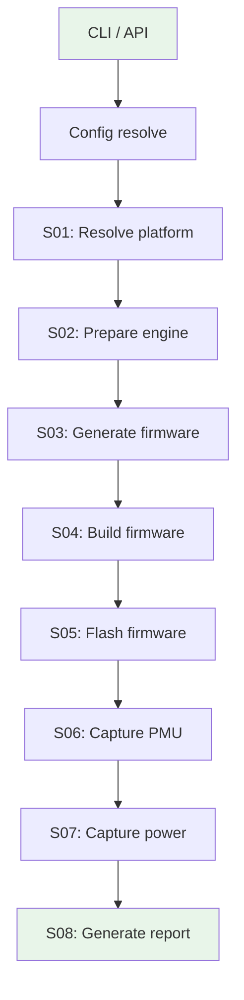

# Architecture Overview

This section is for **contributors, developers, and AI agents** working on
heliaPROFILER internals. It covers the design philosophy, system architecture,
and conventions you need to understand before modifying the codebase.

## What heliaPROFILER is

`hpx` is a **profiler** — it generates temporary firmware, flashes it, captures
hardware performance data, and writes reports. It is:

- A CLI tool (`hpx profile`) and a Python API (`helia_profiler.profile()`)
- Pipeline-based: sequential stages, each with a single responsibility
- Engine-agnostic: the same pipeline serves heliaRT and heliaAOT, with an internal TFLM adapter path retained in source

## What heliaPROFILER is NOT

| Anti-pattern | heliaPROFILER approach |
|---|---|
| Build system | Uses NSX (`nsx configure && nsx build`) — does not reinvent CMake |
| SDK exporter | No code export. Generated firmware is temporary and disposable |
| Application framework | No runtime library. The firmware is a thin profiling harness |
| Multi-engine runner | One engine per run. Always explicit, never auto-detected |

## Design principles

These principles were learned from the [AutoDeploy](https://github.com/AmbiqAI/neuralSPOT)
experience and are non-negotiable:

### 1. Immutable config

The config is resolved **once** at startup and frozen. No field is mutated
after construction. Every stage reads the same `ProfileConfig` object.

```python
# ✅ Correct — read from frozen config
board = ctx.config.target.board

# ❌ Wrong — never mutate config mid-run
ctx.config.target.board = "apollo3p_evb"  # will raise FrozenInstanceError
```

### 2. One engine per run

The user specifies the engine explicitly. There is no "run all engines" mode.
Compare engines by running `hpx profile` twice with different configs.

### 3. Typed stage boundaries

All data flowing between stages uses frozen dataclasses from `results.py`.
The one exception is `LayerResult.counters: dict[str, float]` — PMU counter
names are dynamic and can't be enumerated as fields.

### 4. Subprocess isolation

External tools (GCC, CMake, J-Link, heliaAOT compiler) run via
`subprocess.run()` with argument lists. No `os.system()`, no shell=True,
no monkey-patching `sys.exit`.

### 5. Clear error hierarchy

Every error is a typed subclass of `HpxError` with an optional `hint` field
for actionable guidance:

```
HpxError
├── ConfigError          # Bad YAML, missing fields
├── PlatformError        # Unknown board/SoC
├── EngineError          # Engine adapter failure
├── FirmwareError        # Template rendering failure
├── BuildError           # NSX build failure
├── CaptureError         # SWO/PMU capture failure
├── PowerError           # Joulescope driver failure
└── ReportError          # Report generation failure
```

## High-level flow



Each stage is a class implementing the `Stage` protocol:

```python
class Stage(Protocol):
    name: str
    def run(self, ctx: PipelineContext) -> None: ...
```

The `PipelineRunner` executes stages sequentially. If a stage fails, it
raises a typed error and the pipeline stops with a clear message.

## Module layout

```
src/helia_profiler/
├── cli/                # Typer CLI package
├── api.py              # profile() entry point → PipelineRunner
├── config.py           # ProfileConfig (frozen dataclasses)
├── profiler.py         # build_default_pipeline(), run_profile()
├── pipeline.py         # PipelineContext, Stage protocol, PipelineRunner
├── results.py          # LayerResult, PmuResult, ProfileResult, etc.
├── errors.py           # HpxError hierarchy
├── platform/           # SoC/Board registry
├── nsx.py              # NSX subprocess wrapper (configure/build/flash)
├── counters.py         # PMU counter registry and pass planning
├── doctor.py           # hpx doctor — tool checks
│
├── target/             # Target lifecycle + probe backends
│   ├── lifecycle.py    # Reset/power-cycle policy before capture phases
│   └── probe/
│       └── jlink.py    # J-Link helpers (flash, SWO, reset)
│
├── transport/          # CaptureTransport backend registry
│   ├── protocol.py     # HPX wire protocol (HPX_START/HPX_END framing)
│   ├── rtt.py          # RTT capture backend
│   ├── swo.py          # SWO capture via pylink/J-Link API
│   ├── uart.py         # UART capture backend
│   └── usb_cdc.py      # USB CDC capture backend
│
├── engines/            # Engine adapters
│   ├── base.py         # EngineAdapter protocol, EngineArtifacts
│   ├── tflm.py         # Stock TFLM adapter
│   ├── helia_rt/       # heliaRT adapter package
│   └── helia_aot/      # heliaAOT adapter package
│
├── stages/             # Pipeline stages
│   ├── preflight.py
│   ├── ensure_powered.py
│   ├── resolve_platform.py
│   ├── resolve_probe.py
│   ├── prepare_engine.py
│   ├── analyze_model.py
│   ├── plan_memory.py
│   ├── generate_firmware.py
│   ├── build_firmware.py
│   ├── verify_placement.py
│   ├── flash.py
│   ├── capture_pmu.py
│   ├── capture_power.py
│   └── report.py
│
├── firmware/           # Firmware generation
│   ├── __init__.py     # Template rendering, model→header, build/flash
│   └── templates/      # Jinja2 templates (CMakeLists, main.cc, etc.)
│
├── capture/            # Data acquisition dispatch (capture_pmu/capture_power)
│   └── parser.py         # HPX protocol parser → PmuResult
│
├── power/              # Power measurement drivers
│   ├── base.py         # PowerDriver protocol, PowerResult
│   └── joulescope/     # Joulescope JS110/JS220 driver package
│
└── report/             # Output formatting
    ├── __init__.py     # write_report() dispatcher
    └── model_explorer.py  # ME overlay builder
```

## Key data flow

```
ProfileConfig (frozen)
    ↓
PipelineContext (mutable state bag)
    │
    ├── .config          → ProfileConfig (read-only)
    ├── .platform_info   → PlatformInfo (set by S01)
    ├── .engine_artifacts→ EngineArtifacts (set by S02)
    ├── .build_dir       → Path (set by S04)
    ├── .binary_path     → Path (set by S04)
    ├── .binary_sections → BinarySections (set by S04)
    ├── .pmu_result      → PmuResult (set by S06)
    ├── .power_result    → PowerResult (set by S07)
    └── .run_metadata    → RunMetadata (accumulated across stages)
```

Each stage reads what it needs from the context, does its work, and writes
its output back to the context. Stages never reach into other stages' internals.

## Next

- [Pipeline & Stages](pipeline.md) — detailed stage-by-stage walkthrough
- [Engine Adapters](engine-adapters.md) — how engines wire into the pipeline
- [Firmware Generation](firmware.md) — templates, NSX modules, build process
- [Data Capture](capture.md) — SWO protocol, parsing, multi-pass merging
- [Contributing an Engine](adding-an-engine.md) — step-by-step guide
