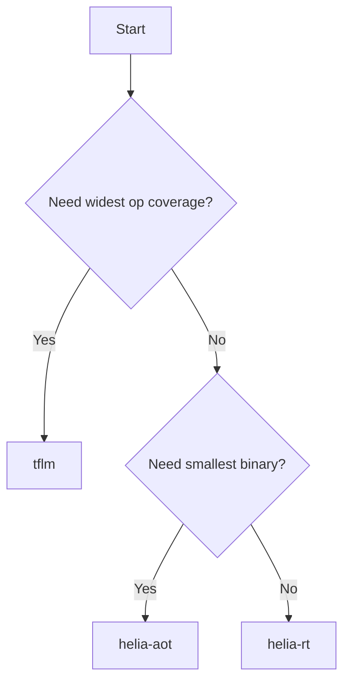

# Inference Engines

heliaPROFILER supports three inference engines. Each profiling run uses
**exactly one** engine — you choose which at configuration time.

## Engine overview

| Engine | `--engine` | Interpreter? | Best for | Binary size |
|---|---|---|---|---|
| Stock TFLM | `tflm` | Yes | Baseline reference | ~570 KB |
| heliaRT | `helia-rt` | Yes | Optimized performance | ~570 KB |
| heliaAOT | `helia-aot` | No | Maximum performance | ~96 KB |

## Stock TFLM

Standard [TensorFlow Lite for Microcontrollers](https://www.tensorflow.org/lite/microcontrollers)
with CMSIS-NN operator kernels. This is the unmodified upstream runtime.

- **Widest model coverage** — supports all TFLite ops
- **Baseline for comparison** — use TFLM results as the "before" benchmark

```yaml title="hpx.yml"
engine:
  type: tflm
```

No additional engine config is required.

## heliaRT

[heliaRT](https://github.com/AmbiqAI/helia-rt) is Ambiq's optimized TFLM fork.
It provides three kernel backends: reference, CMSIS-NN, and **HELIA**
(Ambiq-optimized MVE/DSP kernels).

- **Drop-in replacement** for stock TFLM with better performance
- Same interpreter model — accepts any `.tflite` flatbuffer
- Ships as a pre-built static library pinned to a specific version

```yaml title="hpx.yml"
engine:
  type: helia-rt
  config:
    variant: release-with-logs    # (1)!
    dist_path: path/to/helia_rt   # (2)!
```

1. Library variant. `release-with-logs` enables the firmware to print metadata
   over SWO. Use `release` for minimal overhead.
2. Path to the heliaRT distribution directory containing `lib/`, `tensorflow/`,
   and `third_party/`. The profiler creates an NSX wrapper module pointing to
   this distribution.

### heliaRT engine config

| Field | Type | Default | Description |
|---|---|---|---|
| `variant` | string | `release-with-logs` | Library variant (`release`, `release-with-logs`) |
| `dist_path` | string | *(bundled)* | Path to heliaRT distribution |

### How it wires in

The heliaRT adapter:

1. Creates an `nsx-heliart` local module pointing to the static library
2. Generates a `CMakeLists.txt` and `nsx_module.yaml` wrapper
3. Links the pre-built `.a` archive and exposes TF headers to the build

## heliaAOT

[heliaAOT](https://github.com/AmbiqAI/helia-aot) is Ambiq's ahead-of-time
compiler. It compiles a TFLite model into optimized C code — no interpreter at
runtime.

- **Smallest binary** — no interpreter overhead
- **Fastest inference** — compiled operators with platform-specific optimizations
- Requires CMSIS-NN source (Ambiq's `ns-cmsis-nn` fork)
- Supports a subset of TFLite operators

```yaml title="hpx.yml"
engine:
  type: helia-aot
  config:
    prefix: hpx                              # (1)!
    module_name: hpx_model                   # (2)!
    cmsis_nn_path: path/to/ns-cmsis-nn       # (3)!
```

1. C symbol prefix for generated code (avoids namespace collisions).
2. Name of the generated NSX module.
3. Path to the [AmbiqAI/ns-cmsis-nn](https://github.com/AmbiqAI/ns-cmsis-nn)
   source directory. heliaAOT requires this specific fork (has `weight_sum_ctx`
   parameter extensions).

### heliaAOT engine config

| Field | Type | Default | Description |
|---|---|---|---|
| `prefix` | string | `hpx` | C symbol prefix for generated code |
| `module_name` | string | `hpx_model` | Generated module name |
| `cmsis_nn_path` | string | *(required)* | Path to ns-cmsis-nn source |

### How it wires in

The heliaAOT adapter:

1. Runs the `helia-aot` Python compiler on the model
2. Produces C source files and a `CodeGenContext` with operator metadata
3. Creates two NSX modules:
    - `nsx-cmsis-nn` — the CMSIS-NN source library
    - `nsx-heliaaot-model` — the AOT-compiled model code
4. Extracts the operator manifest (layer names, tensor IDs) for the
   firmware template

### Key assumptions

!!! warning "CMSIS-NN fork required"
    heliaAOT depends on AmbiqAI's `ns-cmsis-nn` fork, not upstream ARM CMSIS-NN.
    The fork adds `weight_sum_ctx` parameters needed by AOT-generated kernels.

!!! warning "Operator coverage"
    heliaAOT supports a subset of TFLite operators (CONV_2D, DEPTHWISE_CONV_2D,
    FULLY_CONNECTED, AVERAGE_POOL_2D, SOFTMAX, RESHAPE, and others). Models with
    unsupported ops will fail during the AOT compilation step with a clear error.

## Choosing an engine



| Scenario | Recommended engine |
|---|---|
| First-time profiling / baseline | `helia-rt` |
| Comparing optimized vs. baseline | `tflm` then `helia-rt` |
| Production deployment analysis | `helia-aot` |
| Unsupported ops / large models | `tflm` or `helia-rt` |
| Smallest flash footprint | `helia-aot` |
