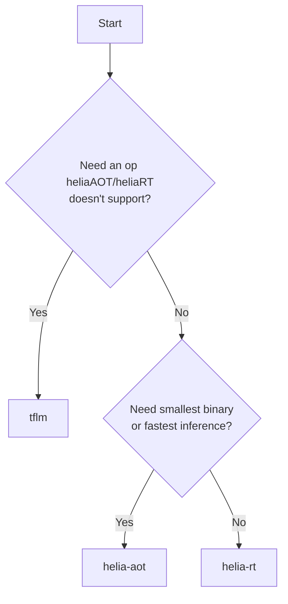

# Inference Engines

heliaPROFILER supports three inference engines. Each profiling run uses
**exactly one** engine — you choose which at configuration time. There is
no "run all" mode; comparison is done by running the profiler more than
once with different configs.

## Overview

| Engine | `--engine` | Interpreter? | Best for | Typical binary |
|---|---|---|---|---|
| Stock TFLM | `tflm` | Yes | Baseline reference | ~570 KB |
| heliaRT | `helia-rt` | Yes | Optimized interpreter performance | ~570 KB |
| heliaAOT | `helia-aot` | No | Maximum performance, smallest code | ~96 KB |

The pipeline, capture protocol, and report format are identical for all
three. Only the firmware payload changes.

## Stock TFLM

Standard [TensorFlow Lite for Microcontrollers](https://www.tensorflow.org/lite/microcontrollers)
with CMSIS-NN operator kernels. Unmodified upstream runtime.

Use it when:

- You need a baseline to compare optimized engines against.
- You're profiling a model with operators that aren't yet covered by
  heliaRT or heliaAOT.

```yaml title="hpx.yml"
engine:
  type: tflm
```

No engine-specific config is required.

## heliaRT

[heliaRT](https://github.com/AmbiqAI/helia-rt) is Ambiq's optimized TFLM
fork. It is a drop-in replacement for stock TFLM with three kernel
backends — reference, CMSIS-NN, and the Ambiq-tuned **HELIA** kernels.

The profiler ships pinned to a specific heliaRT release
(currently **v1.11.2**). Pre-built static libraries are downloaded
automatically the first time you use this engine.

```yaml title="hpx.yml"
engine:
  type: helia-rt
  config:
    variant: release-with-logs   # (1)!
    dist_path: /path/to/helia_rt # (2)!
```

1.  Library variant: `release` (lean), `release-with-logs` (default —
    keeps SWO printf), or `debug`.
2.  Optional. Path to a local heliaRT distribution containing `lib/`,
    `tensorflow/`, and `third_party/`. If unset, the profiler downloads
    the pinned release into a cache directory on first use.

### Distribution resolution

The adapter looks in this order:

1. `engine.config.dist_path` — explicit local path
2. `HELIART_DIST_PATH` environment variable
3. `engine.config.source` — a custom GitHub repo + ref
4. **Auto-download** of the pinned release from `AmbiqAI/helia-rt`

The downloaded distribution contains a `nsx/` directory with a native NSX
module. The profiler uses that module verbatim and links the right
toolchain-specific archive (`libhelia-rt-{gcc,armclang}.a`).

### Toolchain → archive mapping

| `target.toolchain` | heliaRT archive selected |
|---|---|
| `arm-none-eabi-gcc`, `gcc` | `libhelia-rt-gcc.a` |
| `armclang` | `libhelia-rt-armclang.a` |
| `atfe` | falls back to `libhelia-rt-gcc.a` *(with a warning — heliaRT does not yet ship a dedicated ATfE archive)* |

### heliaRT engine config

| Field | Type | Default | Description |
|---|---|---|---|
| `variant` | string | `release-with-logs` | `debug`, `release-with-logs`, or `release` |
| `dist_path` | string | *(auto-download)* | Local heliaRT distribution path |
| `source` | object | *(none)* | `{repo: ..., ref: ...}` for custom upstream |

## heliaAOT

[heliaAOT](https://github.com/AmbiqAI/helia-aot) is Ambiq's ahead-of-time
compiler. It compiles a TFLite model into pure C source — no interpreter
at runtime, no flatbuffer parsing, no per-op dispatch.

```yaml title="hpx.yml"
engine:
  type: helia-aot
  config:
    cmsis_nn_path: /path/to/ns-cmsis-nn   # (1)!
    prefix: hpx                           # (2)!
    module_name: hpx_model                # (3)!
```

1.  **Required.** Path to AmbiqAI's
    [ns-cmsis-nn](https://github.com/AmbiqAI/ns-cmsis-nn) source. Can also
    come from the `CMSIS_NN_PATH` environment variable.
2.  C symbol prefix for generated code (default `hpx`). Avoids
    namespace collisions when linking multiple AOT models.
3.  Generated NSX module name (default `hpx_model`).

### How heliaAOT wires in

The pipeline:

1. Runs the `helia-aot` Python compiler against the `.tflite` model.
2. Emits C source files plus a `CodeGenContext` describing operators and
   tensor IDs.
3. Creates two NSX modules:
   - `nsx-cmsis-nn` — built from the `cmsis_nn_path` source tree.
   - `nsx-heliaaot-model` — the AOT-compiled C code for this specific model.
4. Links them into a profiler firmware image with the same harness used
   for TFLM/heliaRT runs.

### Key constraints

!!! warning "AmbiqAI ns-cmsis-nn fork required"
    heliaAOT depends on AmbiqAI's `ns-cmsis-nn`, **not** upstream ARM
    CMSIS-NN. The fork adds the `weight_sum_ctx` parameters that AOT
    kernels expect. Pointing `cmsis_nn_path` at upstream CMSIS-NN
    (V.19+) raises a clear error during preflight.

!!! warning "Operator coverage"
    heliaAOT supports a curated subset of TFLite ops (CONV_2D,
    DEPTHWISE_CONV_2D, FULLY_CONNECTED, AVERAGE_POOL_2D, MAX_POOL_2D,
    SOFTMAX, RESHAPE, and others). Models with unsupported ops fail
    during AOT compilation with a clear error and the offending op name.

### heliaAOT engine config

| Field | Type | Default | Description |
|---|---|---|---|
| `cmsis_nn_path` | string | *(env or required)* | AmbiqAI ns-cmsis-nn source root |
| `prefix` | string | `hpx` | C symbol prefix |
| `module_name` | string | `hpx_model` | Generated NSX module name |
| `cmsis_nn_requantize_inline_asm` | bool | `true` | Use inline-asm requantization path |
| `aot_args` | dict | `{}` | Pass-through args to the AOT compiler |
| `platform_name` | string | *(from board)* | Override the board → AOT platform mapping |

## Choosing an engine



| Scenario | Recommended |
|---|---|
| First-time profiling, baseline numbers | `helia-rt` |
| Comparing optimized vs. stock | `tflm` then `helia-rt` |
| Production deployment | `helia-aot` |
| Unsupported ops, prototyping new model | `tflm` or `helia-rt` |
| Smallest flash footprint | `helia-aot` |

## Reference numbers

KWS reference model (`examples/quickstart/kws_model.tflite`),
Apollo510 EVB, default counter set, 100 iterations. Cycles are the mean
across iterations.

| Engine | Toolchain | Total cycles | vs heliaRT/GCC |
|---|---|---|---|
| heliaRT | gcc | 2,014,841 | 1.00× (baseline) |
| heliaRT | armclang | 1,874,429 | 0.93× |
| heliaAOT | gcc | 1,965,501 | 0.98× |
| heliaAOT | armclang | 1,869,210 | 0.93× |

The engine-vs-engine spread on this model is small; the toolchain spread
is comparable. Bigger differences appear on convolution-heavy models with
large feature maps. See the
[engine-comparison example](../examples/engine-comparison.md) for a
walkthrough you can re-run on your own model.
