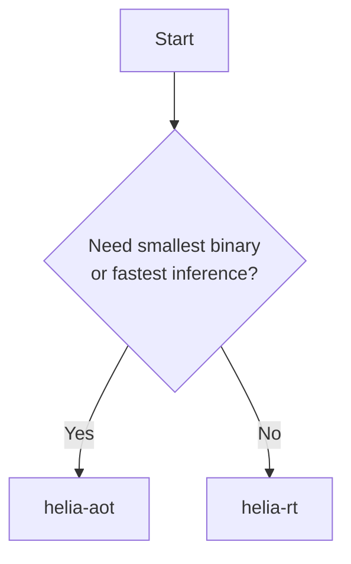

# Inference Engines

heliaPROFILER currently exposes three inference engines. Each profiling run uses
**exactly one** engine — you choose which at configuration time. There is
no "run all" mode; comparison is done by running the profiler more than
once with different configs.

## Overview

| Engine | `--engine` | Interpreter? | Best for | Typical binary |
|---|---|---|---|---|
| Vanilla TFLM | `tflm` | Yes | Baseline interpreter measurement | varies |
| heliaRT | `helia-rt` | Yes | Optimized interpreter performance | ~570 KB |
| heliaAOT | `helia-aot` | No | Maximum performance, smallest code | ~96 KB |

The pipeline, capture protocol, and report format are identical for all three
engines. Only the firmware payload changes.

Vanilla TFLM is intended as a baseline. It uses the separate
`nsx-tflite-micro` port and can select either reference kernels or upstream
CMSIS-NN. It does not enable heliaRT's Ambiq-tuned HELIA backend.

## heliaRT

[heliaRT](https://github.com/AmbiqAI/helia-rt) is Ambiq's optimized TFLM
fork. It is a drop-in replacement for stock TFLM with three kernel
backends — reference, CMSIS-NN, and the Ambiq-tuned **HELIA** kernels.

The generated firmware now derives the resolver surface from model analysis by
default and automatically enables the TFLM resource-variable runtime when the
graph contains `VAR_HANDLE`-style ops. That means models using
`CALL_ONCE` / `VAR_HANDLE` / `ASSIGN_VARIABLE` / `READ_VARIABLE` no longer need
manual firmware edits just to stand up the interpreter.

The profiler ships pinned to a specific heliaRT release
(currently **v1.16.0**) and enforces a minimum supported version
(**v1.16.0**). Pre-built static libraries are downloaded automatically
the first time you use this engine.

### Distribution resolution

There are three ways to point HPX at a heliaRT distribution. The adapter
tries them in order and the first match wins:

#### 1. Default (recommended)

No config — HPX downloads the pinned release from `AmbiqAI/helia-rt`,
caches it under `~/.cache/helia-profiler/heliart/`, and reuses the cache
on subsequent runs.

```yaml title="hpx.yml"
engine:
  type: helia-rt
```

#### 2. Custom version or fork

Override the version (or repo) via `engine.config.source`:

```yaml title="hpx.yml"
engine:
  type: helia-rt
  config:
    source:
      repo: AmbiqAI/helia-rt        # default if omitted
      ref:  helia-rt-v1.16.0        # any release tag; bare "1.16.0" also works
```

The resolved release must be `>= v1.16.0`; older releases are rejected.

#### 3. Local distribution path

Point at an already-extracted distribution on disk:

```yaml title="hpx.yml"
engine:
  type: helia-rt
  config:
    dist_path: /path/to/helia_rt    # or: HELIART_DIST_PATH env var
```

The directory must contain `lib/`, `tensorflow/`, `third_party/`,
`signal/`, and an `nsx/` module (`CMakeLists.txt` + `nsx-module.yaml`).
Version is parsed from `tensorflow/lite/micro/helia_rt_version.h` and
must be `>= v1.16.0`.

### Toolchain → archive mapping

| `target.toolchain` | heliaRT archive selected |
|---|---|
| `arm-none-eabi-gcc`, `gcc` | `libhelia-rt-{core}-gcc-{variant}.a` |
| `armclang` | `libhelia-rt-{core}-armclang-{variant}.a` |
| `atfe` | falls back to `gcc` *(with a warning — heliaRT does not yet ship a dedicated ATfE archive)* |

### heliaRT engine config

| Field | Type | Default | Description |
|---|---|---|---|
| `variant` | string | `release-with-logs` | `debug`, `release-with-logs`, or `release` |
| `resolver_ops` | string | `auto` | Resolver strategy: `auto` registers builtins observed in the model; `all` keeps the broad fixed allowlist |
| `dist_path` | string | *(auto-download)* | Local heliaRT distribution path |
| `source.repo` | string | `AmbiqAI/helia-rt` | GitHub repo for download |
| `source.ref` | string | pinned version | Release tag (e.g. `helia-rt-v1.16.0` or bare `1.16.0`) |

### heliaRT runtime notes

- `resolver_ops: auto` is the default and should stay that way unless you're
  debugging resolver coverage. It reduces binary bloat and now covers the
  resource-variable builtins shipped by heliaRT.
- If a model uses resource-variable ops, HPX counts `VAR_HANDLE` nodes from the
  analyzed graph and wires `MicroResourceVariables` into the generated
  interpreter automatically.
- Size `model.arena_size` from measured output, not guesses. After the first
  successful run, set it to roughly `1.5x` the reported `allocated_arena` in
  `summary.json`.

## heliaAOT

[heliaAOT](https://github.com/AmbiqAI/helia-aot) is Ambiq's ahead-of-time
compiler. It compiles a TFLite model into pure C source — no interpreter
at runtime, no flatbuffer parsing, no per-op dispatch.

```yaml title="hpx.yml"
engine:
  type: helia-aot
  config:
  # cmsis_nn_path: /path/to/ns-cmsis-nn  # (1)!
    prefix: hpx                           # (2)!
    module_name: hpx_model                # (3)!
```

1.  Optional override for AmbiqAI's
  [ns-cmsis-nn](https://github.com/AmbiqAI/ns-cmsis-nn) source. By default
  `hpx` resolves `nsx-cmsis-nn` from the NSX registry. Set `cmsis_nn_path`
  or `CMSIS_NN_PATH` only when you want to vendor a local checkout.
2.  C symbol prefix for generated code (default `hpx`). Avoids
    namespace collisions when linking multiple AOT models.
3.  Generated NSX module name (default `hpx_model`).

### Version policy

heliaAOT ships as a Python package (it runs at build-time), so version
resolution is handled entirely by **pip** — there's no separate cache,
download, or `dist_path` to manage.

The profiler's `[aot]` extra requires `helia-aot>=0.18.0`, and the profiler
also enforces a runtime
**minimum supported version** (`HELIAAOT_MIN_VERSION`) so any compatible
override still has to clear the floor.

You get three modes:

#### 1. Default (recommended)

```bash
pip install 'helia-profiler[aot]'
```

Installs the upstream release tag pinned in the profiler's `pyproject.toml`.

#### 2. Custom version or fork

Override the pin with any newer release tag, a feature branch, or a
personal fork:

```bash
pip install --upgrade \
  'helia-aot @ git+https://github.com/AmbiqAI/helia-aot.git@v0.18.0'

pip install --upgrade \
  'helia-aot @ git+https://github.com/AmbiqAI/helia-aot.git@feat/my-op'

pip install --upgrade \
  'helia-aot @ git+https://github.com/<your-fork>/helia-aot.git@<ref>'
```

Useful when prototyping a new AOT feature against `hpx profile` without
waiting for a release.

#### 3. Local checkout (editable install)

```bash
pip install -e /path/to/helia-aot
```

Edits to your local clone are picked up on the next `hpx profile` run —
no reinstall required.

At engine load, `hpx` reads the installed version via
`importlib.metadata` and raises a clear error if it's below the floor or
if the package isn't installed at all. `hpx doctor` reports whether the
AOT engine is available.

### How heliaAOT wires in

The pipeline:

1. Runs the `helia-aot` Python compiler against the `.tflite` model.
2. Emits C source files plus a `CodeGenContext` describing operators and
   tensor IDs.
3. Creates two NSX modules:
  - `nsx-cmsis-nn` — resolved from the NSX registry by default, or built
    from a local checkout when `cmsis_nn_path` / `CMSIS_NN_PATH` is set.
   - `nsx-heliaaot-model` — the AOT-compiled C code for this specific model.
4. Links them into a profiler firmware image with the same harness used
  for interpreter and AOT runs.

### Key constraints

!!! warning "AmbiqAI ns-cmsis-nn fork required"
    heliaAOT depends on AmbiqAI's `ns-cmsis-nn`, **not** upstream ARM
    CMSIS-NN. The fork adds the `weight_sum_ctx` parameters that AOT
    kernels expect. Pointing `cmsis_nn_path` at upstream CMSIS-NN
    (V.19+) raises a clear error during preflight.

!!! warning "Operator coverage"
    heliaAOT supports a curated subset of TFLite ops (CONV_2D,
    DEPTHWISE_CONV_2D, FULLY_CONNECTED, AVERAGE_POOL_2D, MAX_POOL_2D,
    SOFTMAX, RESHAPE, and others). Models with unsupported ops fail
    during AOT compilation with a clear error and the offending op name.

### heliaAOT engine config

| Field | Type | Default | Description |
|---|---|---|---|
| `cmsis_nn_path` | string | *(registry default)* | Optional local AmbiqAI ns-cmsis-nn source root |
| `prefix` | string | `hpx` | C symbol prefix |
| `module_name` | string | `hpx_model` | Generated NSX module name |
| `cmsis_nn_requantize_inline_asm` | bool | `true` | Use inline-asm requantization path |
| `linker_profile` | string | `default` | NSX linker-script profile (`default`, `itcm`); `itcm` promotes hot kernels into ITCM (Apollo5-family M55 SoCs) |
| `aot_args` | dict | `{}` | Pass-through args to the AOT compiler |
| `platform_name` | string | *(from board)* | Override the board → AOT platform mapping |

## Choosing an engine



| Scenario | Recommended |
|---|---|
| First-time profiling, baseline numbers | `helia-rt` |
| Production deployment | `helia-aot` |
| Unsupported ops, prototyping new model | `helia-rt` |
| Smallest flash footprint | `helia-aot` |

## Reference numbers

KWS reference model (`examples/quickstart/kws_model.tflite`),
Apollo510 EVB, default counter set, 100 iterations. Cycles are the mean
across iterations, shown relative to the heliaRT/GCC baseline (absolute
cycle counts depend on your board, model, and clock configuration — see
[First Profile](../getting-started/first-profile.md) to get your own).

| Engine | Toolchain | Total cycles vs heliaRT/GCC |
|---|---|---|
| heliaRT | gcc | 1.00× (baseline) |
| heliaRT | armclang | ~0.93× |
| heliaAOT | gcc | ~0.98× |
| heliaAOT | armclang | ~0.93× |

The engine-vs-engine spread on this model is small; the toolchain spread
is comparable. Bigger differences appear on convolution-heavy models with
large feature maps. See the
[engine-comparison example](../examples/engine-comparison.md) for a
walkthrough you can re-run on your own model.
