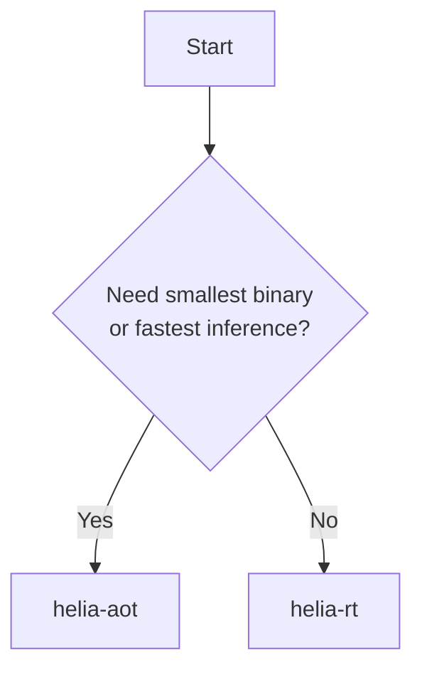

# Inference Engines

heliaPROFILER currently exposes four inference engines. Each profiling run uses
**exactly one** engine — you choose which at configuration time. There is
no "run all" mode; comparison is done by running the profiler more than
once with different configs.

## Overview

| Engine | `--engine` | Interpreter? | Best for |
|---|---|---|---|
| Vanilla TFLM | `tflm` | Yes | Reference or CMSIS-NN interpreter baseline |
| heliaRT | `helia-rt` | Yes | Ambiq-optimized interpreter performance |
| heliaAOT | `helia-aot` | No | Ahead-of-time compilation and fine-grained placement |
| ExecuTorch | `executorch` | No | Cortex-M PTE programs and CMSIS-NN kernels |

The pipeline, capture protocol, and report format are identical for all four
engines. Only the firmware payload changes.

Vanilla TFLM is intended as a baseline. It uses the separate
`nsx-tflite-micro` port and can select either reference kernels or upstream
CMSIS-NN. It does not enable heliaRT's Ambiq-tuned HELIA backend.

## ExecuTorch

The ExecuTorch engine consumes an already exported `.pte` program and builds
the local `nsx-executorch` Cortex-M runtime into the generated NSX firmware.
It uses ExecuTorch's `EventTracer` instruction scopes to reset and sample the
Armv8-M PMU around each kernel or delegate call. This keeps the runtime and
CMSIS-NN kernels unmodified while producing stable instruction identities such
as `OPERATOR_CALL:c0i7` in per-layer results.

```yaml title="hpx.yml"
model:
  path: /path/to/model.pte
  arena_size: 163840

engine:
  type: executorch
  backend: arm  # arm or ns CMSIS-NN provider
  config:
    source_path: /path/to/nsx-executorch
    method_arena_size: 65536
    temporary_arena_size: 32768
    input_size: 12288
    output_size: 40
    portable_ops: []
```

All sizes and the optional portable-operator list are explicit because the embedded runner does not
run an export pipeline or infer a PTE's application I/O contract. When the
PTE was exported with `helia-torch` (the `nsx_cortex_m` AOT package), a
`<model>.pte.json` sidecar travels with it and provides these values as
defaults — see [Sidecar self-configuration](#sidecar-self-configuration)
below. The clean
whole-model measurement is the DWT cycle count of `Method::execute()` only;
program loading, method loading, input/output copies, layer instrumentation,
and report transport are excluded. Per-layer measurements are repeated for
each PMU pass and aggregated by the normal HPX parser.

The profiler validates `nsx_pmu_init()`, runs a CPU-cycle counter self-test,
checks every counter read, and reports true 32-bit chained-counter overflow.
ExecuTorch power capture is not yet supported; keep `power.enabled: false`.
See `configs/executorch/resnet8_cmsis_nn.yaml` for the verified fixture — it
targets `apollo330mP_evb` with `arena_location: sram` (that board's MCU_TCM is
too small for the combined method/temporary/planned arenas) and accepts a
caller-supplied PTE plus a single `nsx-executorch` checkout at `source_path`.
The checkout must be at
commit `4a257def0c3ebd4ecd6a5d412f087d297f1b3492`, the current head of
`nsx-executorch` `main` (the PR #2 merge that adds the out-of-tree
`cortex_m_ns::` Tier 1 operators); HPX does not assume an unpublished
release tag.

`source_path` is the repository root containing `nsx-module.yaml`, not the
embedded ExecuTorch submodule. Initialize the minimal Cortex-M submodules listed
in that repository's README. HPX passes its own Python 3.11+ interpreter to
CMake so the pinned torchgen wrapper also sees HPX's PyYAML dependency. HPX
declares exactly one qualified provider (`arm-cmsis-nn` or `nsx-cmsis-nn`) as
a normal NSX module immediately before `nsx-executorch`. NSX lock/sync therefore
owns provider materialization and uses its standard `NSX_CACHE_DIR` cache;
the runtime's idempotent bridge prevents duplicate targets. The `ns` provider
uses PR #1's private compatibility layer for the v7.29.2 `weight_sum_ctx` ABI.
Set `engine.config.cmsis_nn_path` or `cmsis_nn_ref` to override the selected
provider while preserving the same ordered module contract.

### NS Tier-1 kernels (`ns_ops`)

PTEs exported with `kernel_provider="ns"` may contain `cortex_m_ns::`
operators (sub, hardswish, mean, standalone relu/relu6/hardtanh/clamp,
leaky_relu) backed by ns-cmsis-nn kernels. Running one requires:

```yaml
engine:
  type: executorch
  backend: ns
  config:
    ns_ops: true   # passes NSX_EXECUTORCH_ENABLE_NS_OPS=ON
```

`ns_ops: true` is rejected with `backend: arm` — the kernels only exist in
ns-cmsis-nn — and a `cortex_m_ns::` PTE on a build without NS ops fails fast
at `Method::load()` rather than miscomputing. On the arm provider the same
source model keeps those ops as portable ATen fallbacks (registered via
`portable_ops`), which run in float and dominate per-op cost; see
`TIER1_NS_OPS_COMPARISON.md` for measured deltas.

### Sidecar self-configuration

`helia-torch compile` writes a `<model>.pte.json` manifest next to every PTE
(schema `nsx-executorch.pte-manifest/1`), SHA-256-bound to that exact file.
When present, HPX uses it to default `backend`, `ns_ops`, `portable_ops`,
`planned_arena_size`, `input_size`, and `output_size`, so a minimal config
is just `model.path`, `engine.config.source_path`, and the target board.
Explicit config values always override the sidecar. A sidecar whose hash
does not match the PTE, or an ns PTE with `ns_ops` disabled, is a
config-time error with a hint — never a silent fallback.

### Memory placement

The generated runner owns five static RAM buffers: the memory-planned
(activation) arena, the method arena, the temporary arena, and the
input/output buffers. `model.arena_location` (`tcm` or `sram` only — non-RAM
values are rejected) places all five together; each can be moved
individually:

```yaml
model:
  arena_location: sram              # default for anything not overridden
engine:
  config:
    planned_arena_location: tcm     # touched by every kernel — pays DTCM rent
    method_arena_location: sram     # consumed at Method::load, cold afterwards
    temporary_arena_location: sram  # kernel scratch (e.g. conv im2col buffers)
    io_location: sram               # one memcpy per inference
```

Choose by access frequency: only the planned arena is hot on every operator,
so the canonical split places it in DTCM and everything else in SRAM. Unlike
heliaAOT there is no per-tensor placement — activations are packed inside
the planned arena at export time — see the
[memory guide](memory.md#placement-models-heliaaot-vs-executorch) for the
comparison and the planned multi-region extension.

## heliaRT

[heliaRT](https://github.com/AmbiqAI/helia-rt) is Ambiq's optimized TFLM
fork. It is a drop-in replacement for stock TFLM with three kernel
backends — reference, CMSIS-NN, and the Ambiq-tuned **HELIA** kernels.

The generated firmware now derives the resolver surface from model analysis by
default and automatically enables the TFLM resource-variable runtime when the
graph contains `VAR_HANDLE`-style ops. That means models using
`CALL_ONCE` / `VAR_HANDLE` / `ASSIGN_VARIABLE` / `READ_VARIABLE` no longer need
manual firmware edits just to stand up the interpreter.

The profiler ships pinned to a specific heliaRT release
(currently **v1.16.0**) and enforces a minimum supported version
(**v1.16.0**). In the default flow NSX resolves the pinned
`nsx-helia-rt` registry module and builds it with the selected toolchain.

### Distribution resolution

There are three ways to supply heliaRT:

#### 1. Default (recommended)

No engine path config — HPX declares the pinned `nsx-helia-rt` module and
lets NSX clone, lock, and build it from the registry. The first run needs
network access; later runs reuse the module and build caches.

```yaml title="hpx.yml"
engine:
  type: helia-rt
```

#### 2. Local source checkout

Point at a heliaRT source tree when developing the runtime itself:

```yaml title="hpx.yml"
engine:
  type: helia-rt
  config:
    source_path: /path/to/helia-rt
```

`HELIART_SOURCE_PATH` is the environment-variable equivalent. The checkout
must contain heliaRT's native NSX module.

#### 3. Explicit prebuilt or custom release

Use `dist_path` for an extracted prebuilt distribution, or
`engine.config.source` for a custom GitHub release asset:

```yaml title="hpx.yml"
engine:
  type: helia-rt
  config:
    source:
      repo: AmbiqAI/helia-rt
      ref: helia-rt-v1.16.0
```

```yaml title="hpx.yml"
engine:
  type: helia-rt
  config:
    dist_path: /path/to/helia_rt
```

`HELIART_DIST_PATH` is the environment-variable equivalent. Prebuilt
distributions must contain the headers, NSX wrapper inputs, and an archive
matching the selected core, toolchain, and variant. All explicit sources must
resolve to heliaRT `>= v1.16.0`.

### Toolchain → archive mapping

| `target.toolchain` | heliaRT archive selected |
|---|---|
| `arm-none-eabi-gcc`, `gcc` | `libhelia-rt-{core}-gcc-{variant}.a` |
| `armclang` | `libhelia-rt-{core}-armclang-{variant}.a` |
| `atfe` | `libhelia-rt-{core}-atfe-{variant}.a` |

This table applies only to the explicit prebuilt-distribution mode. The default
registry and local-source modes compile heliaRT with the selected toolchain.

### heliaRT engine config

| Field | Type | Default | Description |
|---|---|---|---|
| `variant` | string | `release-with-logs` | `debug`, `release-with-logs`, or `release` |
| `resolver_ops` | string | `auto` | Resolver strategy: `auto` registers builtins observed in the model; `all` keeps the broad fixed allowlist |
| `source_path` | string | *(registry module)* | Local heliaRT source checkout |
| `dist_path` | string | *(registry module)* | Explicit local prebuilt distribution |
| `source.repo` | string | — | GitHub repo for an explicit prebuilt release |
| `source.ref` | string | — | Explicit release tag |

### heliaRT runtime notes

- `resolver_ops: auto` is the default and should stay that way unless you're
  debugging resolver coverage. It reduces binary bloat and now covers the
  resource-variable builtins shipped by heliaRT.
- If a model uses resource-variable ops, HPX counts `VAR_HANDLE` nodes from the
  analyzed graph and wires `MicroResourceVariables` into the generated
  interpreter automatically.
- Size `model.arena_size` from measured output, not guesses. After the first
  successful run, set it to roughly `1.5x` the reported `allocated_arena` in
  `summary.json`.

## heliaAOT

[heliaAOT](https://github.com/AmbiqAI/helia-aot) is Ambiq's ahead-of-time
compiler. It compiles a TFLite model into pure C source — no interpreter
at runtime, no flatbuffer parsing, no per-op dispatch.

```yaml title="hpx.yml"
engine:
  type: helia-aot
  config:
  # cmsis_nn_path: /path/to/ns-cmsis-nn  # (1)!
    prefix: hpx                           # (2)!
    module_name: hpx_model                # (3)!
```

1.  Optional override for AmbiqAI's
  [ns-cmsis-nn](https://github.com/AmbiqAI/ns-cmsis-nn) source. By default
  `hpx` resolves `nsx-cmsis-nn` from the NSX registry. Set `cmsis_nn_path`
  or `CMSIS_NN_PATH` only when you want to vendor a local checkout.
2.  C symbol prefix for generated code (default `hpx`). Avoids
    namespace collisions when linking multiple AOT models.
3.  Generated NSX module name (default `hpx_model`).

### Version policy

heliaAOT ships as a Python package (it runs at build-time), so version
resolution is handled entirely by **pip** — there's no separate cache,
download, or `dist_path` to manage.

The profiler's `[aot]` extra requires `helia-aot>=0.18.0`, and the profiler
also enforces a runtime
**minimum supported version** (`HELIAAOT_MIN_VERSION`) so any compatible
override still has to clear the floor.

You get three modes:

#### 1. Default (recommended)

```bash
pip install 'helia-profiler[aot]'
```

Installs a compatible PyPI release at or above the supported `0.18.0` floor.

#### 2. Custom version or fork

Override the pin with any newer release tag, a feature branch, or a
personal fork:

```bash
pip install --upgrade \
  'helia-aot @ git+https://github.com/AmbiqAI/helia-aot.git@v0.18.0'

pip install --upgrade \
  'helia-aot @ git+https://github.com/AmbiqAI/helia-aot.git@feat/my-op'

pip install --upgrade \
  'helia-aot @ git+https://github.com/<your-fork>/helia-aot.git@<ref>'
```

Useful when prototyping a new AOT feature against `hpx profile` without
waiting for a release.

#### 3. Local checkout (editable install)

```bash
pip install -e /path/to/helia-aot
```

Edits to your local clone are picked up on the next `hpx profile` run —
no reinstall required.

At engine load, `hpx` reads the installed version via
`importlib.metadata` and raises a clear error if it's below the floor or
if the package isn't installed at all. `hpx doctor` reports whether the
AOT engine is available.

### How heliaAOT wires in

The pipeline:

1. Runs the `helia-aot` Python compiler against the `.tflite` model.
2. Emits C source files plus a `CodeGenContext` describing operators and
   tensor IDs.
3. Creates two NSX modules:
  - `nsx-cmsis-nn` — resolved from the NSX registry by default, or built
    from a local checkout when `cmsis_nn_path` / `CMSIS_NN_PATH` is set.
   - `nsx-heliaaot-model` — the AOT-compiled C code for this specific model.
4. Links them into a profiler firmware image with the same harness used
  for interpreter and AOT runs.

### Key constraints

!!! warning "AmbiqAI ns-cmsis-nn fork required"
    heliaAOT depends on AmbiqAI's `ns-cmsis-nn`, **not** upstream ARM
    CMSIS-NN. The fork adds the `weight_sum_ctx` parameters that AOT
    kernels expect. Pointing `cmsis_nn_path` at upstream CMSIS-NN
    (V.19+) raises a clear error during preflight.

!!! warning "Operator coverage"
    heliaAOT supports a curated subset of TFLite ops (CONV_2D,
    DEPTHWISE_CONV_2D, FULLY_CONNECTED, AVERAGE_POOL_2D, MAX_POOL_2D,
    SOFTMAX, RESHAPE, and others). Models with unsupported ops fail
    during AOT compilation with a clear error and the offending op name.

### heliaAOT engine config

| Field | Type | Default | Description |
|---|---|---|---|
| `cmsis_nn_path` | string | *(registry default)* | Optional local AmbiqAI ns-cmsis-nn source root |
| `prefix` | string | `hpx` | C symbol prefix |
| `module_name` | string | `hpx_model` | Generated NSX module name |
| `cmsis_nn_requantize_inline_asm` | bool | `true` | Use inline-asm requantization path |
| `linker_profile` | string | `default` | NSX linker-script profile (`default`, `itcm`); `itcm` promotes hot kernels into ITCM (Apollo5-family M55 SoCs) |
| `aot_args` | dict | `{}` | Pass-through args to the AOT compiler |
| `platform_name` | string | *(from board)* | Override the board → AOT platform mapping |

## Choosing an engine


```mermaid
graph TD
  A[Start] --> B{Need smallest binary<br/>or fastest inference?}
  B -->|Yes| C[helia-aot]
  B -->|No| D[helia-rt]
```

| Scenario | Recommended |
|---|---|
| First-time profiling | `helia-rt` |
| Upstream interpreter baseline | `tflm` |
| Production deployment | `helia-aot` |
| Unsupported ops, prototyping new model | `helia-rt` |
| Smallest flash footprint | `helia-aot` |

Measure the trade-offs on your own model and hardware. See the
[engine-comparison example](../examples/engine-comparison.md) for a repeatable
walkthrough.
