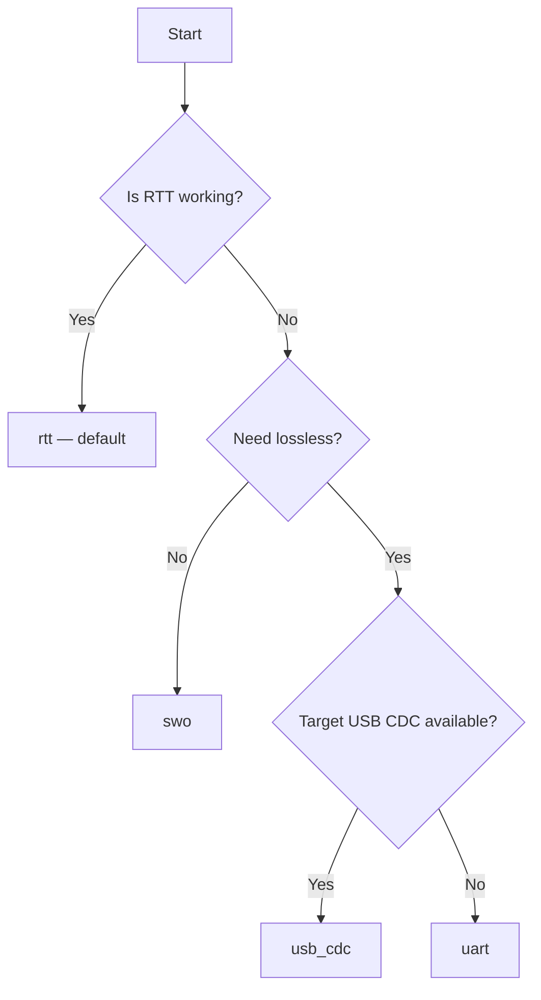

# Capture Transports

heliaPROFILER supports four ways to get profiling data off the target.
The transport affects reliability, throughput, and what hardware you need
plugged in. **RTT is the default and is recommended.**

| `target.transport` | Hardware | Reliability | Throughput | When to use |
|---|---|---|---|---|
| `rtt` *(default)* | J-Link only | Lossless | High | Almost always |
| `usb_cdc` | Target USB cable + J-Link | Lossless (CRC + flow control) | Medium | When RTT isn't available; large data |
| `uart` | J-Link OB VCOM | Best-effort | Low (~11.5 KB/s) | Fallback when USB CDC isn't available |
| `swo` | J-Link only | Lossy | ~1 Mbps | Diagnostics only — drops data silently |

## How transport selection works

```bash
hpx profile model.tflite --transport rtt       # default
hpx profile model.tflite --transport usb_cdc
hpx profile model.tflite --transport uart
hpx profile model.tflite --transport swo
```

or in YAML:

```yaml
target:
  transport: rtt
```

The choice is global across the run — every PMU pass and metadata block
flows over the same transport. `uart` uses the J-Link OB virtual COM port at
115200 8N1, so it is the low-throughput fallback when USB CDC is unavailable.
HPX does not automatically retry with another transport after failure because
the transport changes both generated firmware and capture reliability.

!!! note "Transport choice no longer affects power numbers"
    With the default `power.firmware: dedicated` (see
    [Dedicated power firmware](power.md#dedicated-power-firmware)), power
    capture flashes a separate transport-free binary, so the transport you
    pick here only affects **PMU capture reliability and throughput** — it
    no longer biases current/energy results. That transport-dependent power
    contamination (largest with USB CDC) only applies if you opt into
    `power.firmware: shared`.

## RTT (recommended)

[Segger Real-Time Transfer](https://www.segger.com/products/debug-probes/j-link/technology/about-real-time-transfer/)
uses dedicated buffers in target RAM that the host reads over SWD. No
target peripherals are involved during transfer, which keeps PMU data
clean.

### Hardware

- J-Link probe connected via SWD to the target.
- The same USB connection used for flashing — no extra cables.
- SEGGER RTT target sources bundled with heliaPROFILER. Use
  `target.segger_rtt_path` or `SEGGER_RTT_PATH` only to test an explicit
  alternate checkout.

### How heliaPROFILER uses it

- Opens an RTT session through `pylink` after `JLinkExe` resets the target.
- Uses a **32 KB up-buffer** in the firmware (configured via NSX in trim
  mode). Lines are scanned for the HPX protocol sentinels.
- Supports the PSRAM model handshake: firmware emits `HPX_PSRAM_READY`,
  the host writes the model directly to PSRAM via J-Link, and the
  firmware proceeds with `HPX_GO`.

### Pros / cons

| ✓ | ✗ |
|---|---|
| Lossless | Limited to ~32 KB of in-flight data; firmware blocks if buffer fills |
| Zero target CPU/peripheral interrupts during transfer | Requires J-Link probe |
| Same USB cable as flashing — no extra wiring | |

## USB CDC

The target enumerates as a USB CDC ACM serial device (TinyUSB). The host
opens that serial port and reads the same HPX protocol stream.

### Hardware

- USB cable from the EVB's **target USB** connector (not the J-Link USB)
  to the host.
- A J-Link is still required for **flashing** and target reset.
- Both cables stay plugged in throughout the run.

### How heliaPROFILER uses it

- Auto-detects the target serial port by VID/PID.
- Reads through `pyserial`, line-buffered.
- The firmware **pauses USB polling** (Timer 3) around each PMU
  measurement window so USB interrupts don't pollute the counters.

### Pros / cons

| ✓ | ✗ |
|---|---|
| Lossless — CRC + flow control built into USB | Requires a second USB cable |
| Higher throughput than RTT for very large captures | Target USB stack costs flash and RAM |
| Works on hosts where pylink/RTT is flaky | Some EVBs route the target USB through a hub or switch |

## SWO (legacy / diagnostic)

[Serial Wire Output](https://developer.arm.com/documentation/100748/0623/Debugging-your-application/Using-the-Serial-Wire-Viewer)
streams data over the SWO pin via the target's ITM stimulus port 0.
Captured via the J-Link probe using the `pylink` API.

### Hardware

- J-Link probe with the SWO pin connected. Most Ambiq EVBs route SWO
  through the J-Link header by default.

### Caveats

!!! warning "SWO can drop data"
    SWO has no flow control. At ~1 Mbps the firmware can saturate the
    link during preset transitions and lose lines. The HPX parser
    detects truncated output, but you may see fewer iterations than
    requested or missing layers.

    SWO is retained for diagnostic use — checking that the firmware is
    alive when RTT or USB CDC misbehaves. Switch back to RTT for real
    measurements.

## Choosing a transport



For 95% of runs, the default `rtt` is correct. Switch to `usb_cdc` when:

- You're capturing extremely large per-layer data (every counter, every
  iteration, every layer) and the 32 KB RTT buffer is filling.
- Your host has flaky `pylink`/J-Link RTT support but the target USB
  works fine.
- Your board does not expose a usable target USB CDC path, but the J-Link OB
  virtual COM port is available — use `uart` as the fallback.

## Troubleshooting

??? failure "RTT capture hangs / no data after flash"
    Most often: the firmware is wedged before reaching the HPX protocol.
    Try `--verbose` to see where it stopped. If JLinkExe reports
    `Cannot connect to RTT control block`, run `hpx doctor` to check
    J-Link version (need >= V7.80).

??? failure "USB CDC: serial port not found"
    Replug the **target USB** cable (not just the J-Link). On Linux you
    may need udev rules for the device VID/PID. The profiler logs the
    expected VID/PID on `--verbose`.

??? failure "USB CDC numbers look noisier than RTT"
    The firmware pauses Timer 3 (USB poll) around PMU windows, but on
    some boards there can still be residual USB activity. RTT is
    quieter — switch back if PMU consistency matters.

??? failure "SWO output is truncated"
    Use RTT or USB CDC. SWO is fundamentally lossy.
